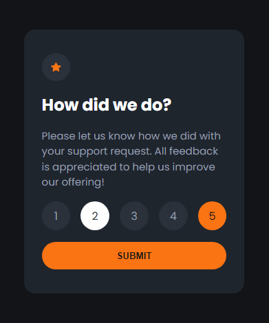
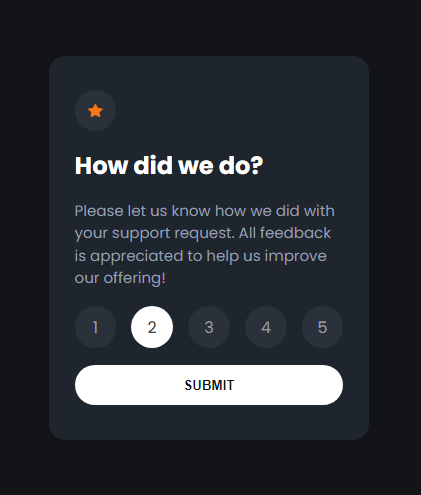
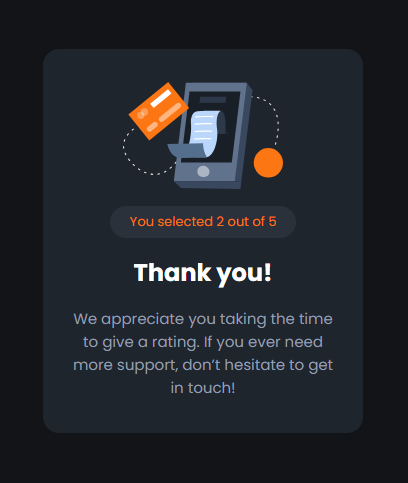

# Frontend Mentor - Interactive rating component solution

This is a solution to the [Interactive rating component challenge on Frontend Mentor](https://www.frontendmentor.io/challenges/interactive-rating-component-koxpeBUmI). Frontend Mentor challenges help you improve your coding skills by building realistic projects.

## Table of contents

- [Overview](#overview)
  - [The challenge](#the-challenge)
  - [Screenshot](#screenshot)
  - [Links](#links)
- [My process](#my-process)
  - [Built with](#built-with)
  - [Useful resources](#useful-resources)
- [Author](#author)

## Overview

### The challenge

Users should be able to:

- View the optimal layout for the app depending on their device's screen size
- See hover states for all interactive elements on the page
- Select and submit a number rating
- See the "Thank you" card state after submitting a rating

### Screenshot

### Links

- Solution URL: [My solution url in Frontend mentor](https://your-solution-url.com)
- Live Site URL: [My live site url in Netlify](https://your-live-site-url.com)

## My process

### Built with

- Semantic HTML5 markup
- CSS custom properties
- Flexbox
- Mobile-first workflow
- [React](https://reactjs.org/) - JS library

### Useful resources

- [From YouTube channel DeepDevs](https://www.youtube.com/watch?v=wekW3a15xBk) - I used this video to deploying and go online my project on Netlify.

## Author

- Frontend Mentor - [@Adib27Moghimi](https://www.frontendmentor.io/profile/Adib27Moghimi)
- GitHub - [Adib27Moghimi](https://github.com/Adib27Moghimi)
- Telegram - [@Adib27Moghimi](https://t.me/Aib27Moghimi)
